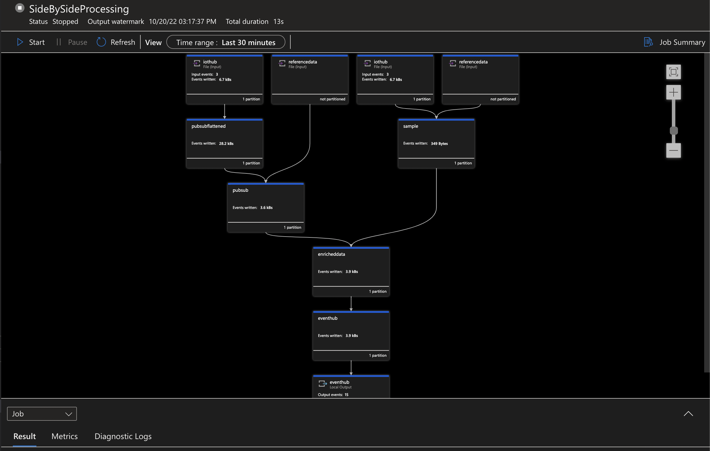

# OPC UA PubSub Message Format

## Overview

This repository serves as a showcase to demonstrate the shift from OPC UA Samples to PubSub message format and its impact to underlying cloud processing layers

## OPC Publisher

OPC Publisher is a fully-supported Microsoft product that bridges the gap between industrial assets and the Microsoft Azure cloud. It does so by connecting OPC UA-enabled assets or industrial connectivity software to your Microsoft Azure cloud. It publishes the telemetry data it gathers to Azure IoT Hub in various formats, including IEC62541 OPC UA PubSub standard format (from version 2.6 onwards). OPC Publisher runs on Azure IoT Edge as a Module or on plain Docker as a container. Because it leverages the .NET cross-platform runtime, it runs natively on both Linux and Windows 10.

See [here](https://learn.microsoft.com/en-us/azure/industrial-iot/overview-what-is-opc-publisher) for more details.

## OPC PLC

Implements an OPC-UA server with different nodes generating random data, anomalies and configuration of user defined nodes.
You can refer to the following [website](https://learn.microsoft.com/en-us/samples/azure-samples/iot-edge-opc-plc/azure-iot-sample-opc-ua-server/) to get more details.

## Message Formats

OPC Publisher comes along with the default message format “Samples”, this is a non-standardized, simple JSON format. OPC Publisher version 2.6 and above supports a standardized OPC UA JSON format named “PubSub”. By switching the configuration to use this newer, industry-standardized message format, you can benefit from increasing schema stability, future proofing solution, etc.

### Example Sample message

```json
[
  {
    "NodeId": "nsu=http://microsoft.com/Opc/OpcPlc/;s=RandomUnsignedInt32",
    "EndpointUrl": "opc.tcp://opcplc:50000/",
    "ApplicationUri": "urn:OpcPlc:opcplc",
    "Timestamp": "2022-10-21T11:26:36.064142Z",
    "Value": {
      "Value": 1029320596,
      "SourceTimestamp": "2022-10-21T11:26:35.9594394Z",
      "ServerTimestamp": "2022-10-21T11:26:35.9594399Z"
    }
  }
]
```

### Example PubSub message

```json
[
    {
      "MessageId": "13",
      "MessageType": "ua-data",
      "PublisherId": "opc.tcp://opcplc:50000_9908E95C",
      "Messages": [
        {
          "DataSetWriterId": "1000",
          "MetaDataVersion": {
            "MajorVersion": 1,
            "MinorVersion": 0
          },
          "Payload": {
            "nsu=http://microsoft.com/Opc/OpcPlc/;s=RandomSignedInt32": {
              "Value": 12,
              "SourceTimestamp": "2022-07-18T08:26:56.3987889Z"
            }
          }
        }
      ]
    }
]
```

## Processing of Edge Device Messages

In general, events created on the edge device are sent to the connected cloud environment for further processing, analyzing and to provide users the right interfaces and services to consume the data.
A recommended way of processing and enriching events for the "Hot Path" is to use Azure Stream Analytics jobs (see [Azure IoT reference architecture](https://learn.microsoft.com/en-us/azure/architecture/reference-architectures/iot)). That also makes it very easy to add static reference data (machine metadata) to the message on a comfortable way.

## Migration Steps

### OPC Publisher Configuration

OPC Publisher makes it very easy to change from default Sample message format to PubSub structure.
Only a parameter _mm_ with a value _PubSub_ needs to be added to the deployment manifest of the OPC Publisher module which is supported from [version 2.6](https://learn.microsoft.com/en-us/azure/industrial-iot/reference-command-line-arguments#command-line-arguments-for-version-26-and-later).

```json
"settings": {
    "image": "mcr.microsoft.com/iotedge/opc-publisher:2.8.3",
    "createOptions": {
        "Hostname": "opcpublisher",
        "Cmd": [
            "--pf=/appdata/config/publisher1.json",
            "--lf=/appdata/publisher.log",
            "--mm=PubSub",
            "--me=Json",
            "--fm=true",
            "--bs=1",
            "--di=20",
            "--aa",
            "--rs=true",
            "--ri=true"
        ],
        "HostConfig": {
            "Binds": [
                "c:/iiotedge:/appdata"
            ],
            "ExtraHosts": [
                "localhost:127.0.0.1"
            ]
        }
    }
}
```

### Flattening of Messages

While the processing of the Sample message format is straight forward, you need to consider the more complex message structure of the the PubSub format which has a key/value pair structure for signals and their telemetry values.
Hence, it is required to flatten the messages in a first step and to make all messages from a batch array available by using [GetArrayElements](https://docs.microsoft.com/en-us/stream-analytics-query/getarrayelements-azure-stream-analytics) and [GetRecordProperties](https://docs.microsoft.com/en-us/stream-analytics-query/getrecordproperties-azure-stream-analytics) functions.

```sql
WITH
PubSubFlattened AS(
SELECT
    ih.*,
    ih.IoTHub.ConnectionDeviceId,
    payload.PropertyValue.StatusCode.Code AS ValueStatusCode,
    payload.PropertyValue.StatusCode.Symbol AS ValueStatusCodeSymbol,
    payload.PropertyName AS PayloadName,
    payload.PropertyValue.Value AS PayloadValue,
    payload.PropertyValue.SourceTimestamp AS PayloadSourceTimestamp,
    payload.PropertyValue.ServerTimestamp AS PayloadServerTimestamp
FROM
    IoTHub AS ih
    CROSS APPLY
    GetArrayElements(ih.Messages) as msg -- GetArrayElements: https://docs.microsoft.com/en-us/stream-analytics-query/getarrayelements-azure-stream-analytics
    CROSS APPLY
    GetRecordProperties(msg.ArrayValue.Payload) AS payload -- GetRecordProperties: https://docs.microsoft.com/en-us/stream-analytics-query/getrecordproperties-azure-stream-analytics

WHERE
    ih.PublisherId IS NOT NULL --identifier in message for PubSub format, not available in Sample format
AND
    ih.MessageType IS NOT NULL --identifier in message for PubSub format, not available in Sample format
)
```

### Side-By-Side Processing

If you already processed messages with the default Sample format, you would have the scenario that messages with both PubSub and Sample structure arrive at the IoTHub and have to be processed properly by the ASA job. A UNION construct resolves that problem where the query condition needs to separate the different formats by evaluating an identifier in the message.

```sql
WHERE
    ih.PublisherId IS NOT NULL --identifier in message for PubSub format, not available in Sample format
```

## How to Run the Sample Solution

### Prerequisites

#### Tooling

1. Install [Docker Desktop](https://www.docker.com/products/docker-desktop/)
2. Install [Azure IoT Tools](https://marketplace.visualstudio.com/items?itemName=vsciot-vscode.azure-iot-tools) Visual Studio Code extension that includes Azure IoT Edge extension now
3. Install [Azure Stream Analytics Tools](https://marketplace.visualstudio.com/items?itemName=ms-bigdatatools.vscode-asa)

#### Azure

Although the sample is built to fully run locally by using json input files, you can also run it by setting up a simple Azure cloud infrastructure containing the following resources:

1. Create [Azure IoT Hub](https://learn.microsoft.com/en-us/azure/iot-hub/iot-hub-create-through-portal)
2. Register [IoT Edge Device](https://learn.microsoft.com/en-us/azure/iot-hub/iot-hub-create-through-portal)
3. Create [Sql Database](https://learn.microsoft.com/en-us/azure/azure-sql/database/single-database-create-quickstart?view=azuresql&tabs=azure-portal) --> add one reference data table that contains your device´s metadata by using Sql Server Management Studio, Azure Data Studio or the Azure Portal
4. Optional: Create [Event Hub](https://learn.microsoft.com/en-us/azure/event-hubs/event-hubs-create) --> not required if you use local output when running the ASA job
5. Add your credentials and connection strings to
   - ./streamanalytics/PubPubProcessing/Inputs/IoTHub.json
   - ./streamanalytics/PubPubProcessing/Inputs/ReferenceData.json
   - ./streamanalytics/PubPubProcessing/Outputs/EventHub.json
   - ./streamanalytics/PubPubProcessing/Outputs/EventHub.json
6. Add right sql query in ./streamanalytics/PubSubProcessing/Inputs/ReferenceData.snapshot.sql to obtain metadata
7. Optional: Create [Stream Analytics job](https://learn.microsoft.com/en-us/azure/stream-analytics/stream-analytics-quick-create-portal), you have to add the content from file _SideBySideProcessing.asaql_ to the job query as reference data input and also add the [input](https://learn.microsoft.com/en-us/azure/stream-analytics/stream-analytics-quick-create-portal#configure-job-input) and [output](https://learn.microsoft.com/en-us/azure/stream-analytics/stream-analytics-quick-create-portal#configure-job-output) connectors --> this step is not required to run the sample if a local run from VS Code is simulated
8. Connect Azure IoT Hub (device) explorer to your IoT Hub and right-click your IoT Edge device and select "Setup IoT Edge Simulator"
9. Right-click file _deployment.<YOUR-OS>.template.json_ and select "Build and Run IoT Edge Solution in Simulator"
10. Right click ./streamanalytics/PubSubProcessing/SideBySideProcessing.asaql and select "ASA: Start Local Run" to start the ASA job
    - Option a: select "Use Live Input and Local Output" --> so you can consume the the events that are auto-generated by OPC PLC module and published to IoT Hub by OPC Publisher module
    - Option b: select "Use Local Input and Local Output" --> so you can skip step 7 and 8 and the run uses the IoTHubLocal.json and ReferenceDataLocal.json as input mocks

